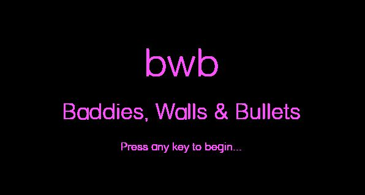
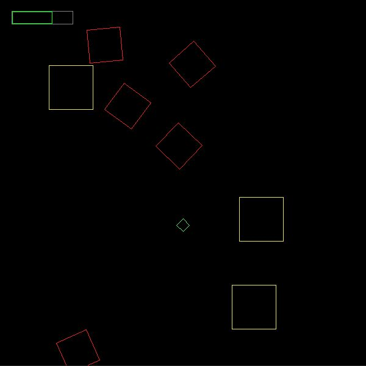

# bwb

A basic game developed as a learning exercise for Rust.

## How to Play

From the repo root, run:  
`cargo run`

In-game, the keys are:

Up/Down: Move  
Left/Right: Shoot

## Supported Platforms
Windows only - for simplicity there are dependencies on pre-built SDL binaries.

## Notes

* Levels are procedurally generated. The seed is hardcoded. Not sure if this is consistent across other platforms/machines.
* Collision detection is multithreaded using Rayon - this is pointless for normal play, but I was curious. There are some stress testing levels - override the starting level to 99 or -1 (look for `StartingLevel(1)` in `title_screen`). The algorithm consists of a simple spatial hash (broad phase) and then separating axis (narrow phase).